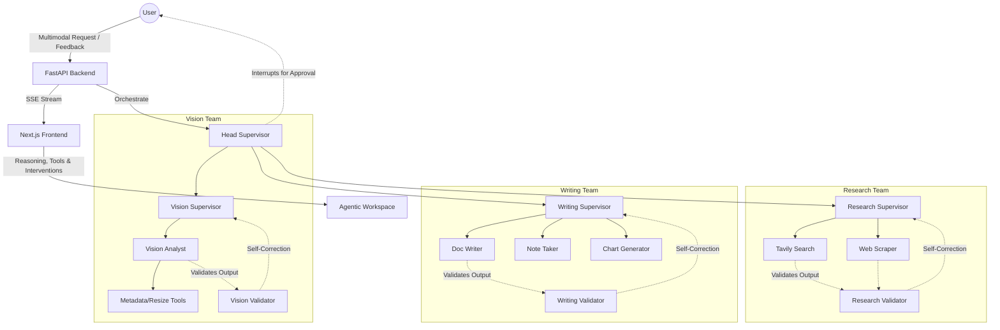

# 🤖 OrchAgent: Hierarchical Multi-Agent Platform

[](https://www.python.org/downloads/release/python-3120/)
[](https://fastapi.tiangolo.com/)
[](https://github.com/langchain-ai/langgraph)
[](https://nextjs.org/)
[](https://github.com/astral-sh/uv)

> **OrchAgent** is an enterprise-grade multimodal agent platform that decomposes complex tasks into a hierarchical multi-agent team structure (`Head Supervisor -> Team Supervisor -> Worker`) and visualizes their reasoning processes in real-time.

---

## ✨ Key Features

- **🧩 Hierarchical Orchestration**: Automated task decomposition and execution using a Multi-Supervisor architecture powered by `LangGraph` Native Subgraphs.
- **🛡️ HITL & Validation**:
    - **Interactive Interruption**: Head Supervisors can suspend execution for dangerous operations, prompting users via the UI for approval, rejection, or feedback.
    - **Self-Correction Loop**: Built-in Critic/Validator nodes evaluate worker outputs and reroute tasks automatically if hallucination or omission is detected.
- **🖼️ Multimodal Pipeline (VLM)**: Integrated Vision Team capable of deep image analysis and manipulation alongside text processing (Powered by GPT-4o / GPT-5.4).
- **🛠️ Dynamic Tool Provisioning**: Context-aware injection of tools into worker agents at runtime based on the state (`active_tools`).
- **💎 Agentic UI (Glassmorphism)**:
    - Real-time SSE streaming of the agent's **Internal Reasoning Summary**.
    - Transparent visualization of tool calls, inputs, and outputs via the Live Trace panel.
    - Seamlessly integrated HITL Action UI for user interventions.
- **⏱️ Business Telemetry**:
    - All telemetry and logging strictly adhere to **KST (Korean Standard Time)**.
    - Segregated `.jsonl` logging for Users, Usage, and Sessions, independent of the SQL Trace DB.
- **✅ Reliability & Quality**: Ensuring code integrity via `pre-commit` (Ruff, ty, ESLint) and comprehensive test coverage (20+ unit/integration tests).

---

## 🏗️ System Architecture



---

## 📂 Project Structure

| Path | Description |
| :--- | :--- |
| **`apps/backend`** | FastAPI server hosting the LangGraph workflow engine, Resume API, and Trace/Logging services |
| **`apps/frontend`** | Next.js 16 based Glassmorphism agent dashboard featuring HITL components and real-time SSE parsing |
| **`packages/agent-core`** | Core state definitions, Supervisor builders, Dynamic Tool bindings, and Validator nodes |
| **`packages/agent-tools`** | Shared collection of asynchronous tools (Search, Scraping, Python REPL, Pillow Vision) |
| **`packages/prompt-kit`** | Centralized system prompt management for distinct agent personas |
| **`docs/`** | Architectural recommendations and research reports |
| **`plans/`** | Project roadmap and detailed feature implementation plans |

---

## 🚀 Quick Start

### 1. Environment Setup
Create an `.env` file in the `apps/backend` directory and set up your API keys.
```bash
# apps/backend/.env
OPENAI_API_KEY=your_openai_api_key
TAVILY_API_KEY=your_tavily_api_key
```

### 2. Run with Docker
The easiest way to spin up the entire stack:
```bash
./infra/scripts/start-dev.sh
```

### 3. Backend Development & Testing (Local)
```bash
cd apps/backend
uv sync
uv run pytest tests/ -v
uv run uvicorn main:app --reload --port 8000
```

### 4. Frontend Development (Local)
```bash
cd apps/frontend
npm install
npm run dev
```

---

## 📄 License
This project is licensed under the MIT License.

---
<p align="center">Developed with precision by DONGRYEOLLEE</p>
