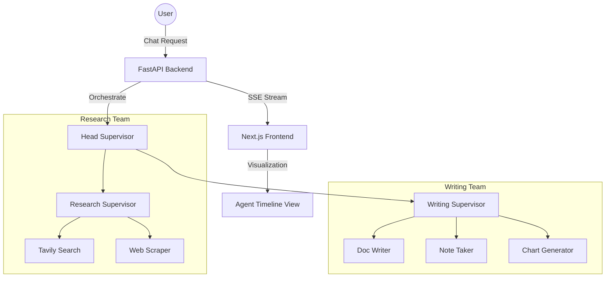

# 🤖 OrchAgent: Hierarchical Multi-Agent Platform

[](https://www.python.org/downloads/release/python-3120/)
[](https://fastapi.tiangolo.com/)
[](https://github.com/langchain-ai/langgraph)
[](https://nextjs.org/)
[](https://github.com/astral-sh/uv)

> **OrchAgent**는 복잡한 작업을 계층형 에이전트 팀(`Head Supervisor -> Team Supervisor -> Worker`)으로 분해하여 실행하고, 그 사고 과정을 실시간으로 가시화하는 엔터프라이즈급 멀티 에이전트 플랫폼입니다.

---

## ✨ Key Features

- **🧩 계층형 오케스트레이션**: `LangGraph`를 활용한 Supervisor-Worker 패턴의 다층 구조.
- **⏱️ 실시간 실행 가시화**: SSE(Server-Sent Events)를 통한 에이전트 타임라인 및 도구 사용 현황 모니터링.
- **🛠️ 확장 가능한 도구 상자**: Tavily Search, Python REPL, File I/O 등 모듈화된 에이전트 도구 패키지.
- **💾 상태 영속성**: `PostgreSQL` 기반의 Checkpointer를 통한 대화 스레드 복구 및 실행 이력 추적.
- **📦 모노레포 아키텍처**: `uv` 워크스페이스 기반의 고성능 패키지 관리 및 코드 공유.

---

## 🏗️ System Architecture



---

## 📂 Project Structure

| Path | Description |
| :--- | :--- |
| **`apps/backend`** | FastAPI 서버, LangGraph 워크플로우 엔진 |
| **`apps/frontend`** | Next.js 14 기반의 에이전트 모니터링 대시보드 |
| **`packages/agent-core`** | 에이전트 상태 정의 및 Supervisor 추상화 빌더 |
| **`packages/agent-tools`** | 검색, 스크래핑, 파일 IO 등 공유 도구 모음 |
| **`packages/prompt-kit`** | 중앙 집중식 시스템 프롬프트 관리 패키지 |
| **`infra/`** | Docker Compose 및 배포 스크립트 |

---

## 🚀 Quick Start

### Prerequisites
- [uv](https://github.com/astral-sh/uv) (Python package manager)
- [Node.js 20+](https://nodejs.org/)
- [Docker & Docker Compose](https://www.docker.com/)

### 1. Environment Setup
루트 디렉터리에 `.env` 파일을 생성하고 API 키를 설정합니다.
```bash
# .env
OPENAI_API_KEY=your_openai_api_key
TAVILY_API_KEY=your_tavily_api_key
```

### 2. Run with Docker (Recommended)
인프라 스크립트를 사용하여 전체 스택을 한 번에 실행합니다.
```bash
./infra/scripts/start-dev.sh
```
- **Frontend**: `http://localhost:3000`
- **Backend API**: `http://localhost:8000`
- **API Docs**: `http://localhost:8000/docs`

### 3. Manual Development
**Backend:**
```bash
cd apps/backend
uv sync
PYTHONPATH=. uv run uvicorn main:app --reload
```

**Frontend:**
```bash
cd apps/frontend
npm install
npm run dev
```

---

## 🛠️ Tech Stack

- **Backend**: Python 3.12, FastAPI, LangGraph, SQLAlchemy, Asyncpg
- **Frontend**: Next.js 14, TypeScript, Tailwind CSS, Lucide React
- **Database**: PostgreSQL 15 (Checkpoint & Trace Storage)
- **DevOps**: Docker, UV, SSE-Starlette

---

## 📄 License
This project is licensed under the MIT License - see the [LICENSE](LICENSE) file for details.

---
<p align="center">Made with by DONGRYEOLLEE</p>
