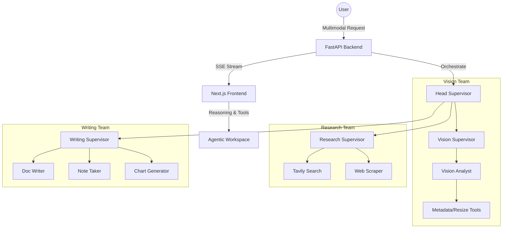

# 🤖 OrchAgent: Hierarchical Multi-Agent Platform

[](https://www.python.org/downloads/release/python-3120/)
[](https://fastapi.tiangolo.com/)
[](https://github.com/langchain-ai/langgraph)
[](https://nextjs.org/)
[](https://github.com/astral-sh/uv)

> **OrchAgent**는 복잡한 작업을 계층형 에이전트 팀(`Head Supervisor -> Team Supervisor -> Worker`)으로 분해하여 실행하고, 그 사고 과정을 실시간으로 가시화하는 엔터프라이즈급 멀티모달 에이전트 플랫폼입니다.

---

## ✨ Key Features

- **🧩 계층형 오케스트레이션**: `LangGraph` 기반의 Multi-Supervisor 아키텍처로 복잡한 테스크를 자동 분해 및 실행.
- **🖼️ 멀티모달 파이프라인 (VLM)**: 텍스트뿐만 아니라 **이미지 분석**이 가능한 Vision Team 통합 (GPT-5.4 기반).
- **💎 Agentic UI (Glassmorphism)**: 
    - 에이전트의 **내부 사고 과정(Reasoning Summary)** 실시간 스트리밍.
    - 도구 호출(Tool Calls)의 입력/출력 및 실행 상태를 투명한 패널로 시각화.
- **⏱️ 비즈니스 텔레메트리**: 
    - 모든 데이터는 **KST(한국 시간)** 기준으로 로깅.
    - DB(SQL)와 별도로 `.jsonl` 기반의 세부 로그(User, Usage, Session) 구획화.
- **🛡️ 안정성 및 품질**: `pre-commit` (Ruff, ty, ESLint) 및 20종 이상의 단위/통합 테스트를 통한 코드 무결성 보장.

---

## 🏗️ System Architecture



---

## 📂 Project Structure

| Path | Description |
| :--- | :--- |
| **`apps/backend`** | FastAPI 서버, LangGraph 워크플로우 엔진, Trace/Logging 서비스 |
| **`apps/frontend`** | Next.js 14 기반의 글래스모피즘 에이전트 대시보드 |
| **`packages/agent-core`** | 에이전트 상태 정의, Supervisor 추상화 빌더 |
| **`packages/agent-tools`** | 검색, 스크래핑, 시각 도구(Pillow) 등 공유 도구 모음 |
| **`packages/prompt-kit`** | 중앙 집중식 시스템 프롬프트(v2.0) 관리 패키지 |
| **`plans/`** | 프로젝트 로드맵 및 상세 확장 계획 문서 |

---

## 🚀 Quick Start

### 1. Environment Setup
루트 디렉터리에 `.env` 파일을 생성하고 API 키를 설정합니다.
```bash
# apps/backend/.env
OPENAI_API_KEY=your_openai_api_key
TAVILY_API_KEY=your_tavily_api_key
```

### 2. Run with Docker
```bash
./infra/scripts/start-dev.sh
```

### 3. Testing
```bash
cd apps/backend
uv run pytest tests/ -v
```

---

## 📄 License
This project is licensed under the MIT License.

---
<p align="center">Developed with precision by DONGRYEOLLEE</p>
