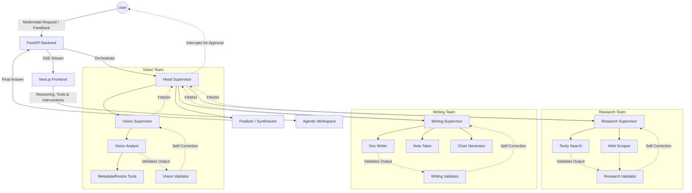

# 🤖 OrchAgent: Hierarchical Multi-Agent Platform

[](https://www.python.org/downloads/release/python-3120/)
[](https://fastapi.tiangolo.com/)
[](https://github.com/langchain-ai/langgraph)
[](https://nextjs.org/)
[](https://github.com/astral-sh/uv)

> **OrchAgent** is a hierarchical multi-agent workspace built around `LangGraph`, `FastAPI`, and `Next.js`. It routes requests through a `Head Supervisor -> Team Supervisor -> Worker` structure and exposes reasoning summaries, tool activity, routing, and checkpoints in real time.

---

## ✨ What It Does

- **🧩 Hierarchical Orchestration**: A head supervisor delegates to specialized `research`, `writing`, and `vision` team subgraphs, and each team routes work to its own workers.
- **🛡️ HITL & Validation**:
    - **Interactive Interruption**: Head-level routing can pause for human approval, rejection, or feedback before resuming the same thread.
    - **Self-Correction Loop**: Team validators review worker outputs and send failures back through the supervisor with correction feedback.
- **🖼️ Multimodal Input Path**: Text requests can include images, which are routed to the vision team and processed with model-native vision plus image metadata and resize tools.
- **🛠️ Tool-Aware Workers**: Research, writing, and vision workers run with task-specific tools, and the worker layer is structured to support state-driven tool filtering.
- **💎 Agentic UI**:
    - Real-time SSE streaming for `status`, `route`, `reasoning`, `tool`, `text`, and `checkpoint` events.
    - A workspace UI that shows internal progress instead of only the final answer.
    - Resume controls for human-in-the-loop actions.
- **⏱️ Trace & Session Logging**:
    - SQL-backed trace events for execution replay and inspection.
    - Separate `.jsonl` session and usage logs for lightweight telemetry.
- **✅ Reliability Work**:
    - Backend tests covering workflow compilation, SSE contracts, validator edge cases, resume behavior, disconnect handling, and trace persistence.
    - Frontend build verification and SSE parser tests for stream handling.

---

## 🎯 Current Scope

This repository is best described as an **advanced prototype focused on orchestration, observability, and recovery**.

- Strong today: hierarchical routing, normalized SSE streaming, checkpoint/resume, validator loops, traceability, and a dedicated agent workspace UI.
- Still being hardened: authentication, stricter tool sandboxing, production policy controls, and some frontend/runtime configuration cleanup.

---

## 🏗️ System Architecture


```mermaid
graph TD
    User((User)) -->|Multimodal Request / Feedback| API[FastAPI Backend]
    API -->|Orchestrate| Head[Head Supervisor]
    Head -.->|Interrupts for Approval| User

    %% Final Synthesis Path
    Head --> Finalizer[Finalizer / Synthesizer]
    Finalizer -->|Final Answer| API

    subgraph Vision Team
        Head --> VS[Vision Supervisor]
        VS --> VAnalyst[Vision Analyst]
        VAnalyst --> VTools[Metadata/Resize Tools]
        VAnalyst -.->|Validates Output| VValidator[Vision Validator]
        VValidator -.->|Self-Correction| VS
        VS -.->|FINISH| Head
    end

    subgraph Research Team
        Head --> RS[Research Supervisor]
        RS --> Search[Tavily Search]
        RS --> Scraper[Web Scraper]
        Search -.->|Validates Output| RValidator[Research Validator]
        Scraper -.-> RValidator
        RValidator -.->|Self-Correction| RS
        RS -.->|FINISH| Head
    end

    subgraph Writing Team
        Head --> WS[Writing Supervisor]
        WS --> Writer[Doc Writer]
        WS --> Noter[Note Taker]
        WS --> Chart[Chart Generator]
        Writer -.->|Validates Output| WValidator[Writing Validator]
        WValidator -.->|Self-Correction| WS
        WS -.->|FINISH| Head
    end

    API -->|SSE Stream| UI[Next.js Frontend]
    UI -->|Reasoning, Tools & Interventions| Dashboard[Agentic Workspace]
```

---

## 📂 Project Structure

| Path | Description |
| :--- | :--- |
| **`apps/backend`** | FastAPI server for LangGraph execution, SSE streaming, resume endpoints, trace persistence, and session logging |
| **`apps/frontend`** | Next.js 16 agent workspace UI with chat, tool activity, reasoning, timeline, and HITL controls |
| **`packages/agent-core`** | Shared orchestration primitives: state schema, supervisor logic, team builder, and validator nodes |
| **`packages/agent-tools`** | Shared worker tools for web research, document I/O, Python execution, and image utilities |
| **`packages/prompt-kit`** | Prompt templates for worker personas and team behavior |
| **`docs/`** | Architectural recommendations and research reports |
| **`plans/`** | Project roadmap and detailed feature implementation plans |

---

## 🚀 Quick Start

### 1. Environment Setup
Create an `.env` file in the `apps/backend` directory and set up your API keys.
```bash
# apps/backend/.env
OPENAI_API_KEY=your_openai_api_key
TAVILY_API_KEY=your_tavily_api_key
```

### 2. Run with Docker
The easiest way to spin up the entire stack:
```bash
./infra/scripts/start-dev.sh
```
This compose stack runs in development mode with bind mounts and autoreload.
Changes under `apps/backend`, `apps/frontend`, and `packages/*` are reflected without rebuilding containers.
Rebuild the stack only when dependencies, lockfiles, or Dockerfiles change.
The frontend container may run `npm install` on first boot to populate its dev `node_modules` volume.

### 3. Backend Development & Testing (Local)
```bash
cd apps/backend
uv sync
uv run pytest tests/ -v
uv run uvicorn main:app --reload --port 8002
```

### 4. Frontend Development (Local)
```bash
cd apps/frontend
npm install
npm run dev
```

### 5. Frontend Verification
```bash
cd apps/frontend
node --test src/lib/chat-stream.test.mjs
npm run build
```

### 6. Container Logs
```bash
docker compose -f infra/compose/docker-compose.yml logs -f backend
docker compose -f infra/compose/docker-compose.yml logs -f frontend
```

---

## 📄 License
This project is licensed under the MIT License.

---
<p align="center">Developed with precision by DONGRYEOLLEE</p>
